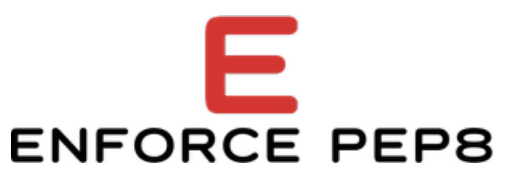

[](https://www.python.org/)
[](https://travis-ci.org/vyahello/enforce-pep8)
[](https://coveralls.io/github/vyahello/enforce-pep8?branch=master)
[](https://github.com/psf/black)
[](https://www.pylint.org)
[](http://flake8.pycqa.org/)
[](http://www.pydocstyle.org/)
[](http://mypy-lang.org/)
[](LICENSE.md)
[](https://www.elegantobjects.org)
[](https://pypi.python.org/pypi/enforce-pep8/)
[](https://pypi.python.org/pypi/enforce-pep8/)

# Enforce PEP-8

> Package allows to enforce certain kinds of **PEP-8** convention coding styles (or perform overall code diagnostics).
> It aims to help maintain programmers sanity while making any code changes.
> In large object-oriented programs, it can sometimes be useful to put class definitions under control of a metaclass
> that are used to alert programmers to potential problems.
> 
> Most important that package enforces you to write **clear** and **concise pythonic** code.

## Tools

- python 3.6 | 3.7 | 3.8
- code analysis
  - [pytest](https://pypi.org/project/pytest/)
  - [black](https://black.readthedocs.io/en/stable/)
  - [mypy](http://mypy.readthedocs.io/en/latest)
  - [pylint](https://www.pylint.org/)
  - [flake8](http://flake8.pycqa.org/en/latest/)

## Usage

### Installation

Please run following script to obtain latest package from PYPI:
```bash
➜ pip install enforce-pep8
✨ 🍰 ✨
```
### Quick start

**Bad class name**: lowercase class name is defined
```python
>>> from punish.style import AbstractStyle
>>>
>>> class stylish(AbstractStyle):
...     def name(self) -> None:
...         pass
...
Traceback (most recent call last):
  File "<stdin>", line 1, in <module>
  punish.style.BadClassNameError
Class name 'stylish' specified in lowercase. Consider to use camelcase style!
```

**Bad attribute name**: camelcase method name is defined
```python
>>> from punish.style import AbstractStyle
>>>
>>> class Stylish(AbstractStyle):
...     def showName(self) -> None:
...         pass
...
Traceback (most recent call last):
  File "<stdin>", line 1, in <module>
  punish.style.BadAttributeNameError
Bad attribute name is specified: 'Stylish:showName'. Consider to use lowercase style: 'Stylish:showname'! 
```

**Bad method signature**: method signature mismatch within base and child classes
```python
>>> from punish.style import AbstractStyle
>>>
>>> class Stylish(AbstractStyle):
...     def show(self, indent: str = ":") -> str:
...         pass
...
...
... class SoStylish(Stylish):
...     def show(self, indent: str = ":", not_expected_argument: bool = False) -> str:
...         pass
...
Traceback (most recent call last):
  File "<stdin>", line 1, in <module>
  punish.style.SignatureError
Signature mismatch in 'SoStylish.show', 
(self, indent: str = ':') -> str != (self, indent: str = ':', not_expected_argument: bool = False) -> str 
```

### Source code

```bash
➜ git clone git@github.com:vyahello/enforce-pep8.git
➜ pip install -e .
```

Or using direct source:
```bash
➜ pip install git+https://github.com/vyahello/enforce-pep8@0.0.1
```
**[⬆ back to top](#enforce-pep-8)**

## Development notes

### Testing

Please execute command below to run unittests with `pytest` tool:
```bash
➜ pytest
```

### CI

Project has Travis CI integration using [.travis.yml](.travis.yml) file thus code analysis (`black`, `pylint`, `flake8`, `mypy`, `pydocstyle`) and unittests (`pytest`) will be run automatically after every made change to the repository.

To be able to run code analysis, please execute command below:
```bash
➜ ./analyse-source-code.sh
```
### Release notes

Please check [changelog](CHANGELOG.md) file to get more details about actual versions and it's release notes.

### Meta

Author – _Volodymyr Yahello_. Please check [authors](AUTHORS.md) file for more details.

Distributed under the `MIT` license. See [LICENSE](LICENSE.md) for more information.

You can reach out me at:
* [vyahello@gmail.com](vyahello@gmail.com)
* [https://github.com/vyahello](https://github.com/vyahello)
* [https://www.linkedin.com/in/volodymyr-yahello-821746127](https://www.linkedin.com/in/volodymyr-yahello-821746127)

### Contributing
1. clone the repository
2. configure Git for the first time after cloning with your `name` and `email`
3. `pip install -r requirements.txt` to install all project dependencies
4. `pip install -r requirements-dev.txt` to install all development project dependencies

**[⬆ back to top](#enforce-pep-8)**

## What's next

Project is inspired mainly by **pythonic** PEP8 code style reflected at https://www.python.org/dev/peps/pep-0008.
Also decent ideas are described in https://github.com/zedr/clean-code-python project.

In general, future releases will contain API implementations from mentioned style guides above.

**[⬆ back to top](#enforce-pep-8)**